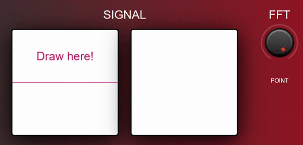

# Fourier Synth

This is a browser-based midi synthesiser with custom wave sources. This project aim to demonstrate a new way of controlling timbre. The timbre is controlled by changing the signal content of the waveform adjusted by the FFT points.

The interactive canvas of waveforms was built by [Fourier](https://github.com/Jezzamonn/fourier) project. It is the source of the synthesiser signal. The rest of the signal processing is built on [Web Audio API](https://github.com/WebAudio/web-audio-api).

## Live Demo

A live demo is available [here](https://dcishurt.github.io/FourierSynth/).

## Features

- Support multiple controller including :
  - Mouse and Keyboard
  - Multi-touch devices
  - USB midi controller

- Built-in audio effects including :
  - `Envelope`
  - `Digital Delay`
  - `Overdrive`
  - `Lowpass Filter`

- Support MIDI Polyphonic Expression ([MPE](https://www.midi.org/midi-articles/midi-polyphonic-expression-mpe)) standard.

## How to play?

1. Draw a waveform on the interactive canvas and adjust the number of FFT points to obtain the base signal to be synthesised.

    

2. Play with mouse, keyboard or usb midi controller.

3. Keyboard Mapping

    |   Key    |   Note    |   Key    |   Note    |
    | -------- | --------- | -------- | --------- |
    | `z`      | `C3`      |          |           |
    | `x`      | `D3`      | `s`      | `C#4`     |
    | `c`      | `E3`      | `d`      | `D#4`     |
    | `v`      | `F3`      |          |           |
    | `b`      | `G3`      | `g`      | `F#4`     |
    | `n`      | `A3`      | `h`      | `G#4`     |
    | `m`      | `B3`      | `j`      | `A#4`     |
    | `q`      | `C4`      |          |           |
    | `w`      | `D4`      | `2`      | `C#4`     |
    | `e`      | `E4`      | `3`      | `D#4`     |
    | `r`      | `F4`      |          |           |
    | `t`      | `G4`      | `5`      | `F#4`     |
    | `y`      | `A4`      | `6`      | `G#4`     |
    | `u`      | `B4`      | `7`      | `A#4`     |
    | `i`      | `C4`      |          |           |

4. Midi CC Table

    | Parameter         | CC MSB      | CC LSB      | Range         |
    | ----------------  | ----------- | ----------- | ------------- |
    | `FFT points`      | `0x02`      | `0 - 127`   | `1 - 128`     |
    | `LPF Coutoff Freq`| `0x03`      | `0 - 127`   | `240 - 24KHz` |
    | `LPF Resonance`   | `0x04`      | `0 - 127`   | `1 - 21`      |
    | `Attack Time`     | `0x05`      | `0 - 127`   | `0 - 2s`      |
    | `Decay Time`      | `0x06`      | `0 - 127`   | `0 - 2s`      |
    | `Delay Time`      | `0x07`      | `0 - 127`   | `0 - 2s`      |
    | `Delay Dry/Wet`   | `0x08`      | `0 - 127`   | `0 - 100%`    |
    | `Overdrive`       | `0x09`      | `0 - 127`   | `0 - 100%`    |
    | `Master Volume`   | `0x0A`      | `0 - 127`   | `0 - 100%`    |

## Installation

1. Install [Node.js](https://nodejs.org/en/download)

2. Clone this repository

    ```cmd
    git clone https://github.com/DCisHurt/FourierSynth.git
    ```

3. Install depences

    ```cmd
    npm install
    ```

4. Optional : Use the Webpack tool to bundle all JavaScript files and generate static web page

    ```cmd
    webpack
    ```

## Credits

- [fourier](https://github.com/Jezzamonn/fourier)
- [web-audio-api](https://github.com/WebAudio/web-audio-api)
- [webaudio-controls](https://github.com/g200kg/webaudio-controls)

## License

MIT
